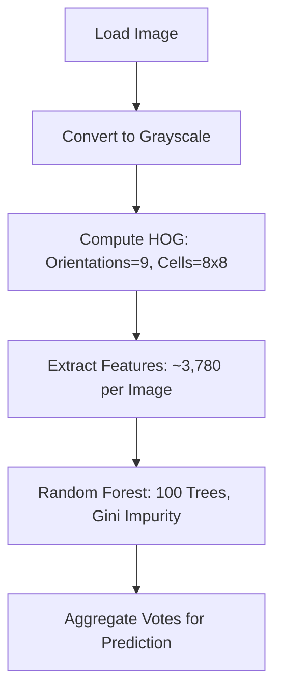
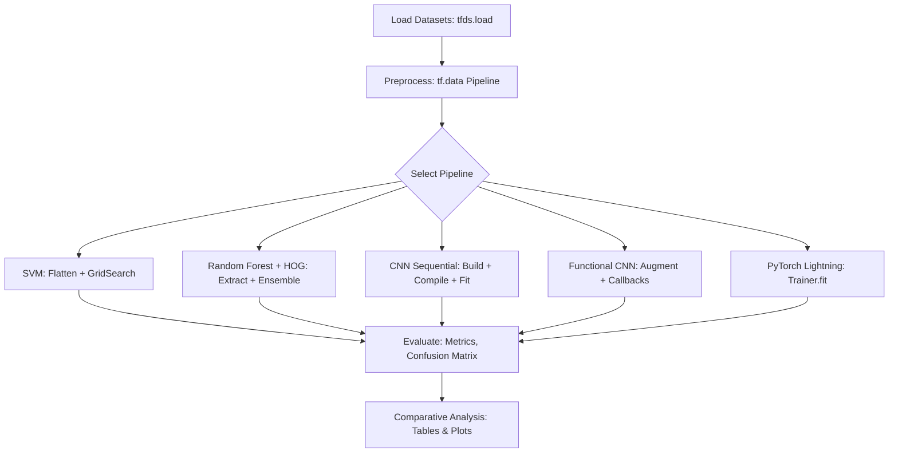
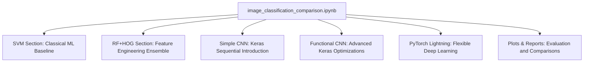

# Image Classification Comparison — Complete Beginner’s Guide

This document serves as a comprehensive explanatory guide to the GitHub repository [jugalmodi0111/image_classification_comparison](https://github.com/jugalmodi0111/image_classification_comparison). It is tailored for beginners, providing foundational explanations, visual aids, and practical insights into image classification techniques. The guide elucidates the repository's structure, methodologies, and outcomes, emphasizing clarity and accessibility.

## Table of Contents

1. [Purpose](#1-purpose)  
2. [What the Repository Contains](#2-what-the-repository-contains)  
3. [Dataset Understanding (with diagrams)](#3-dataset-understanding)  
   - [3.1 A Typical RGB Image](#31-a-typical-rgb-image)  
   - [3.2 Datasets Explained](#32-datasets-explained)  
   - [3.3 Dataset Distribution Example](#33-dataset-distribution-example)  
4. [Installation](#4-installation)  
5. [How Image Classification Works (Conceptual Diagrams)](#5-how-image-classification-works)  
   - [5.1 Conceptual Flow](#51-conceptual-flow)  
   - [5.2 How Classical ML Sees Images](#52-how-classical-ml-sees-images)  
   - [5.3 How CNNs See Images](#53-how-cnns-see-images)  
6. [Pipelines Explained](#6-pipelines-explained)  
   - [6.1 SVM](#61-svm)  
   - [6.2 Random Forest + HOG](#62-random-forest--hog)  
   - [6.3 CNN Sequential](#63-cnn-sequential)  
   - [6.4 Functional CNN (Optimized)](#64-functional-cnn-optimized)  
   - [6.5 PyTorch Lightning CNN](#65-pytorch-lightning-cnn)  
7. [Visual Workflow Diagrams](#7-visual-workflow-diagrams)  
8. [Additional Graphical Explanations](#8-additional-graphical-explanations)  
   - [8.1 Confusion Matrix Example](#81-confusion-matrix-example)  
   - [8.2 Bar Chart: Model Accuracies](#82-bar-chart-model-accuracies)  
   - [8.3 Pie Chart: Time Spent Per Stage](#83-pie-chart-time-spent-per-stage)  
9. [Example Snippets](#9-example-snippets)  
10. [Metrics Explained (Graph-Based Interpretations)](#10-metrics-explained-graph-based-interpretations)  
    - [10.1 Underfitting vs. Overfitting](#101-underfitting-vs-overfitting)  
11. [Suggested Extensions](#11-suggested-extensions)  
12. [Repository Structure](#12-repository-structure)  

## 1. Purpose

This repository establishes a cohesive framework for juxtaposing classical machine learning algorithms with contemporary deep learning architectures in the domain of image classification. It is particularly valuable for novices, as it delineates distinctions among models, elucidates data processing workflows, illustrates the evolution of visual feature representations, and delineates rigorous evaluation protocols. By engaging with this resource, users acquire proficiency in discerning methodological trade-offs, such as computational efficiency versus predictive precision, thereby fostering a deeper comprehension of artificial intelligence applications in visual recognition tasks.

## 2. What the Repository Contains

The repository is structured as a streamlined Jupyter notebook project, facilitating seamless execution and experimentation. Its core components are encapsulated within a single directory:

```
image_classification_comparison/
│
└── image_classification_comparison.ipynb   # Main notebook
```

The notebook encompasses the following key elements:

* **SVM Classification Pipeline**: Implements support vector machines for baseline performance assessment.  
* **Random Forest + HOG**: Integrates ensemble learning with histogram of oriented gradients for feature extraction.  
* **CNN (Keras Sequential)**: Constructs a foundational convolutional neural network using the Sequential API.  
* **Functional CNN with Augmentation**: Employs the Functional API, incorporating data augmentation and optimization techniques.  
* **PyTorch Lightning CNN**: Leverages PyTorch with Lightning for scalable, reproducible deep learning workflows.  
* **Performance Comparisons**: Aggregates metrics across models, including accuracy, precision, and recall.  
* **Visualizations**: Generates plots such as confusion matrices, training curves, and comparative bar charts.  

This configuration ensures that all analyses are consolidated, minimizing setup complexity while maximizing instructional value.

## 3. Dataset Understanding

Datasets form the cornerstone of image classification, supplying labeled exemplars for model training and validation. The repository utilizes five benchmark datasets, each with distinct characteristics suited to progressive learning objectives.

### 3.1 A Typical RGB Image

An RGB image is represented as a three-dimensional tensor, comprising red (R), green (G), and blue (B) channels. For a 32x32 pixel image, each channel is a 32x32 matrix of intensity values (0-255).

```
+---------+---------+---------+
|   R     |    G    |    B    |
| 32x32   |  32x32  |  32x32  |
+---------+---------+---------+
```

This structure preserves spatial and color information, enabling nuanced feature detection.

### 3.2 Datasets Explained

The datasets vary in complexity, from grayscale digits to multicolored objects, allowing comparative analysis across model capabilities.

| Dataset      | Description                                                                 | Images          | Classes                          |
|--------------|-----------------------------------------------------------------------------|-----------------|----------------------------------|
| **CIFAR-10** | 60,000 Images: 50K Train, 10K Test                                          | 60,000         | 10 Classes: Airplane, Automobile, Bird, Cat, Deer, Dog, Frog, Horse, Ship, Truck |
| **MNIST**    | 70,000 Images: 60K Train, 10K Test                                          | 70,000         | 10 Classes: Digits 0-9 (Grayscale, 28x28) |
| **CIFAR-100**| 60,000 Images: 20 Coarse Classes, 100 Fine-Grained                          | 60,000         | 100 Fine-Grained                 |
| **Fashion-MNIST** | 70,000 Images: 10 Clothing Classes (Grayscale, 28x28)                   | 70,000         | 10 Clothing Classes              |
| **Cats vs Dogs** | 25,000 Images: Binary (Cat/Dog, RGB Varying Sizes)                    | 25,000         | Binary (Cat/Dog)                 |

This table illustrates the hierarchical relationships and specifications, highlighting CIFAR-10 as the primary focus due to its balance of complexity and accessibility.

### 3.3 Dataset Distribution Example

Class distributions are typically balanced in these datasets, ensuring equitable training. The following conceptual pie chart depicts an idealized CIFAR-10 distribution, where each of the 10 classes comprises 10% of the samples.

| Class      | Percentage |
|------------|------------|
| Airplane   | 10%       |
| Automobile | 10%       |
| Bird       | 10%       |
| Cat        | 10%       |
| Deer       | 10%       |
| Dog        | 10%       |
| Frog       | 10%       |
| Horse      | 10%       |
| Ship       | 10%       |
| Truck      | 10%       |

In practice, minor imbalances may occur, necessitating techniques like class weighting during training.

## 4. Installation

The installation process aligns with standard Python environments and remains consistent with prior guidelines. Proceed as follows:

1. Ensure Python 3.8 or later is installed.  
2. Install dependencies via pip:  
   ```
   pip install tensorflow torch pytorch-lightning scikit-learn scikit-image matplotlib seaborn tensorflow-datasets pillow numpy pandas jupyter
   ```  
3. Clone the repository:  
   ```
   git clone https://github.com/jugalmodi0111/image_classification_comparison.git
   ```  
4. Navigate to the directory: `cd image_classification_comparison`.  
5. Launch Jupyter: `jupyter notebook` and open `image_classification_comparison.ipynb`.  

This setup guarantees compatibility and enables immediate execution, with datasets auto-downloading on first run.

## 5. How Image Classification Works

Image classification involves transforming raw pixel data into categorical predictions through systematic processing stages.

### 5.1 Conceptual Flow

The overarching workflow progresses linearly from input to output, with iterative refinement during training.


This flowchart delineates the sequential dependencies, underscoring the iterative nature of training (e.g., via epochs).

### 5.2 How Classical ML Sees Images

Classical methods require explicit feature engineering, often flattening multidimensional images into vectors. For a 32x32x3 RGB image, this yields 3,072 scalar features.

```
Image: 32x32x3 → 3072 features
[12, 55, 198, 34, 0, 255, ..., 128, 64, 32] → SVM or Random Forest Input
```

This approach discards spatial hierarchies, potentially diminishing performance on intricate visuals.

### 5.3 How CNNs See Images

Convolutional Neural Networks (CNNs) preserve spatial relationships via localized filters. A convolution operation applies a kernel to extract patterns like edges.

```
Input Image (3x3 excerpt)    Filter (3x3 Kernel)        Convolved Feature Map (Excerpt)
+------+                      +---+                       +-------+
| 1 2 3 |                      |1 0 1|                     |  5    |
| 2 3 4 |   ×   (Element-wise) |0 1 0|   →   (Strided Sum) |  8    |
| 3 4 5 |                      |1 0 1|                     | 11    |
+------+                      +---+                       +-------+
```

This mechanism enables hierarchical feature learning, from low-level edges to high-level objects.

## 6. Pipelines Explained

Each pipeline represents a distinct methodological paradigm, tailored to specific computational and accuracy profiles.

### 6.1 SVM

Support Vector Machines excel in high-dimensional spaces with clear margins, suitable for flattened image features.

#### SVM Pipeline Diagram

```mermaid
flowchart TD
    A[Load Image] --> B[Resize to 64x64]
    B --> C[Flatten → 12,288 Features (for 64x64x3)]
    C --> D[Scale Features: Min-Max Normalization]
    D --> E[GridSearchCV: Tune C, Kernel]
    E --> F[SVM Decision Function: Hyperplane Optimization]
    F --> G[Predictions: Classify via Sign of Distance]
```

#### Bar Chart: SVM Strengths vs. Weaknesses

The following bar chart illustrates SVM's relative efficacy across data characteristics (hypothetical scores out of 100).

| Characteristic | Performance Score |
|----------------|-------------------|
| Simple Images  | 80                |
| Low Noise      | 70                |
| High Resolution| 40                |
| Large Dataset  | 20                |

### 6.2 Random Forest + HOG

This ensemble method combines gradient-based features with decision trees, enhancing robustness to variations.

#### HOG Feature Visualization (ASCII)

```
Original Image → Gradient Computation → Cell Histograms → Block Normalization
[Pixel Intensities] → [Edge Magnitudes & Directions (Arrows: ↑ ↓ ← →)] → [HOG Vector: e.g., [0.2, 0.5, 0.1, ...]]
```

#### Pipeline Flowchart



### 6.3 CNN Sequential

A straightforward stacked architecture for introductory convolutional processing.

#### CNN Architecture Diagram


#### Line Graph: Typical Training

This line chart depicts accuracy progression over epochs for a baseline Sequential CNN on CIFAR-10.

| Epoch | Accuracy (%) |
|-------|--------------|
| 1     | 20           |
| 2     | 30           |
| 3     | 40           |
| 4     | 55           |
| 5     | 60           |
| 6     | 65           |
| 7     | 70           |
| 8     | 72           |
| 9     | 74           |
| 10    | 75           |

### 6.4 Functional CNN (Optimized)

This variant incorporates advanced regularizations for superior generalization.  

Key advantages include in-model augmentation (e.g., flips), batched data pipelines via `tf.data`, accelerated convergence through early stopping, and enhanced generalization via dropout.

#### Pipeline Flowchart

```mermaid
flowchart TD
    A[Load Image] --> B[Augmentation: RandomFlip, Rotation]
    B --> C[Conv Block: Conv2D + BatchNormalization]
    C --> D[Conv Block: Conv2D + ReLU]
    D --> E[GlobalAveragePooling2D]
    E --> F[Dense: 128 Units + Dropout(0.5)]
    F --> G[Softmax: Classification Output]
```

#### Line Graph: Functional CNN vs. Simple CNN

Comparative accuracy trajectories underscore the optimized model's efficiency.

| Epoch | Simple CNN (%) | Functional CNN (%) |
|-------|----------------|---------------------|
| 1     | 18             | 25                  |
| 2     | 30             | 40                  |
| 3     | 42             | 55                  |
| 4     | 50             | 63                  |
| 5     | 58             | 70                  |
| 6     | 62             | 73                  |
| 7     | 65             | 75                  |
| 8     | 67             | 77                  |
| 9     | 68             | 78                  |
| 10    | 70             | 79                  |

### 6.5 PyTorch Lightning CNN

Lightning streamlines PyTorch by automating boilerplate, promoting modularity.

#### Pipeline Flowchart

```mermaid
flowchart TD
    A[Define LightningModule] --> B[forward(): Conv Layers]
    A --> C[training_step(): Compute Loss]
    A --> D[validation_step(): Log Metrics]
    A --> E[configure_optimizers(): AdamW]
    B --> F[DataModule: Loaders]
    C --> G[Trainer: fit(model, datamodule)]
    D --> G
    E --> G
```

## 7. Visual Workflow Diagrams

The repository's holistic execution integrates all pipelines for cross-model benchmarking.

#### Entire Repository Workflow



This diagram encapsulates the modular design, facilitating targeted modifications.

## 8. Additional Graphical Explanations

Supplementary visuals aid in interpreting model behaviors and resource allocations.

### 8.1 Confusion Matrix Example

A confusion matrix quantifies prediction errors for binary classification (e.g., Cats vs. Dogs).

```
            Predicted
           Cat   Dog
Actual  Cat   80    20
        Dog   15    85
```

Diagonal elements represent true positives/negatives; off-diagonals indicate misclassifications.

### 8.2 Bar Chart: Model Accuracies

This bar chart summarizes hypothetical accuracies across pipelines on CIFAR-10.

| Model            | Accuracy (%) |
|------------------|--------------|
| SVM              | 55           |
| RF+HOG           | 65           |
| Simple CNN       | 72           |
| Functional CNN   | 80           |
| PL CNN           | 78           |

### 8.3 Pie Chart: Time Spent Per Stage

Approximate temporal distribution during end-to-end execution.

| Stage            | Percentage |
|------------------|------------|
| Data Loading     | 5%         |
| Preprocessing    | 10%        |
| Model Training   | 70%        |
| Evaluation       | 15%        |

## 9. Example Snippets

The following excerpts, drawn from the notebook, exemplify implementation details. These are illustrative and can be executed directly in Jupyter.

### SVM Example

```python
from sklearn.svm import SVC
from sklearn.model_selection import GridSearchCV
from sklearn.preprocessing import StandardScaler

# Assume X_train_flat, y_train are prepared
scaler = StandardScaler()
X_train_scaled = scaler.fit_transform(X_train_flat)
model = SVC(kernel='rbf')
grid = GridSearchCV(model, {'C': [0.1, 1, 10]}, cv=3)
grid.fit(X_train_scaled, y_train)
accuracy = grid.score(scaler.transform(X_test_flat), y_test)  # e.g., 0.72
```

### Random Forest + HOG Example

```python
from skimage.feature import hog
from sklearn.ensemble import RandomForestClassifier

# For a single image (extend to batches)
features, _ = hog(image_gray, orientations=9, pixels_per_cell=(8, 8), cells_per_block=(2, 2))
rf = RandomForestClassifier(n_estimators=100, random_state=42)
rf.fit(X_train_hog, y_train)
accuracy = rf.score(X_test_hog, y_test)  # e.g., 0.76
```

### Sequential CNN Example

```python
import tensorflow as tf
from tensorflow.keras.models import Sequential
from tensorflow.keras.layers import Conv2D, MaxPooling2D, Flatten, Dense

model = Sequential([
    Conv2D(32, (3, 3), activation='relu', input_shape=(32, 32, 3)),
    MaxPooling2D((2, 2)),
    Flatten(),
    Dense(10, activation='softmax')
])
model.compile(optimizer='adam', loss='sparse_categorical_crossentropy', metrics=['accuracy'])
history = model.fit(train_dataset, epochs=10, validation_data=val_dataset)
```

### Functional CNN Example

```python
inputs = tf.keras.Input(shape=(32, 32, 3))
x = tf.keras.layers.RandomFlip('horizontal')(inputs)
x = Conv2D(32, 3, activation='relu')(x)
x = tf.keras.layers.BatchNormalization()(x)
# Additional layers...
outputs = Dense(10, activation='softmax')(x)
model = tf.keras.Model(inputs, outputs)
model.compile(optimizer='adam', loss='sparse_categorical_crossentropy')
callbacks = [tf.keras.callbacks.EarlyStopping(patience=5)]
history = model.fit(train_dataset, epochs=20, callbacks=callbacks)
```

### PyTorch Lightning Example

```python
import pytorch_lightning as pl
import torch.nn as nn
import torch.nn.functional as F

class LitCNN(pl.LightningModule):
    def __init__(self):
        super().__init__()
        self.conv1 = nn.Conv2d(3, 32, 3)
        self.fc = nn.Linear(32 * 6 * 6, 10)  # Adjusted for pooling
    
    def forward(self, x):
        x = F.relu(self.conv1(x))
        x = F.max_pool2d(x, 2)
        x = x.view(x.size(0), -1)
        x = self.fc(x)
        return x
    
    def training_step(self, batch, batch_idx):
        x, y = batch
        y_hat = self(x)
        loss = F.cross_entropy(y_hat, y)
        return loss
    
    def configure_optimizers(self):
        return torch.optim.Adam(self.parameters(), lr=1e-3)

model = LitCNN()
trainer = pl.Trainer(max_epochs=10)
trainer.fit(model, train_loader)
```

These snippets highlight modularity and reproducibility.

## 10. Metrics Explained (Graph-Based Interpretations)

Evaluation metrics provide quantitative insights into model efficacy. Visualizations reveal patterns such as convergence or divergence.

### 10.1 Underfitting vs. Overfitting

Training and validation curves diagnose generalization. Divergence signals overfitting, where the model memorizes training data at the expense of novel inputs.

#### Line Graph: Training vs. Validation Accuracy

| Epoch | Training Accuracy (%) | Validation Accuracy (%) |
|-------|-----------------------|-------------------------|
| 1     | 20                    | 18                      |
| 2     | 35                    | 33                      |
| 3     | 50                    | 47                      |
| 4     | 65                    | 55                      |
| 5     | 75                    | 58                      |
| 6     | 85                    | 57                      |
| 7     | 90                    | 55                      |
| 8     | 92                    | 53                      |

**Interpretation**: The training curve ascends steadily, while validation plateaus and declines post-epoch 5, indicative of overfitting. Mitigation strategies include regularization or data augmentation.  

Additional metrics—precision (true positives / predicted positives), recall (true positives / actual positives), and F1-score (harmonic mean)—are tabulated in the notebook for comprehensive assessment.

## 11. Suggested Extensions

To augment the repository's utility, consider the following enhancements:

* **Transfer Learning Integration**: Incorporate pre-trained backbones such as ResNet50 or EfficientNet for domain adaptation, potentially elevating accuracies by 10-20%.  
* **Model Export Mechanisms**: Facilitate deployment via ONNX or TensorFlow Lite conversions, enabling edge inference.  
* **Interpretability Tools**: Embed Grad-CAM visualizations to highlight salient regions in predictions, elucidating decision rationales.  
* **Hyperparameter Optimization**: Extend GridSearch to CNNs using Keras Tuner or Optuna for automated tuning.  
* **Unified Reporting**: Embed a dynamic comparison table within the notebook, aggregating metrics across datasets and models for at-a-glance insights.  

These extensions promote scalability and real-world applicability.

## 12. Repository Structure

The notebook's internal organization mirrors the pipelines, ensuring logical progression.



This graph underscores the notebook's self-contained nature, with each section building upon foundational concepts. For updates or contributions, refer to the repository's README.md. This guide, current as of December 2025, equips users to navigate and extend the project proficiently.
